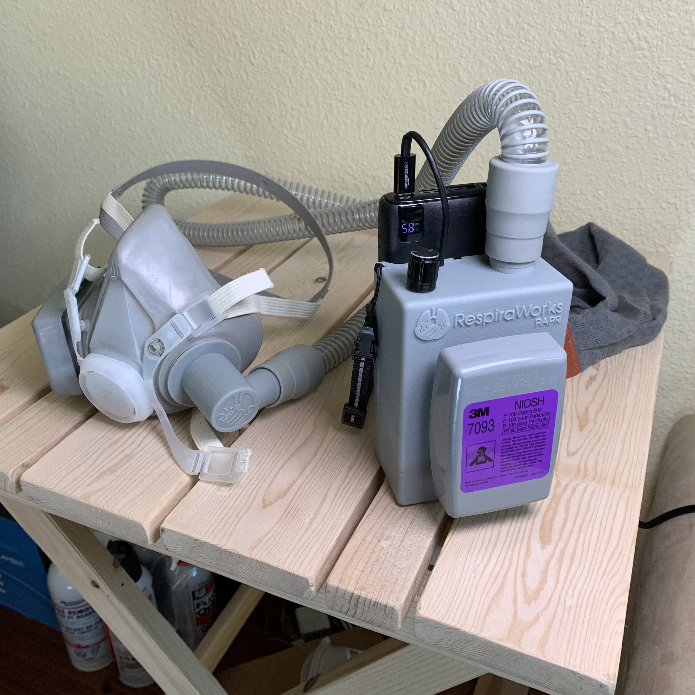
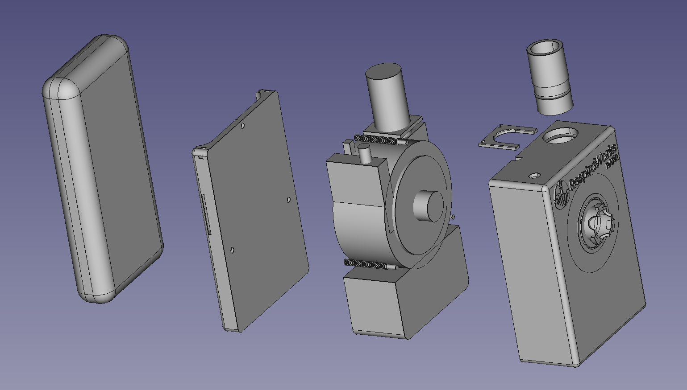
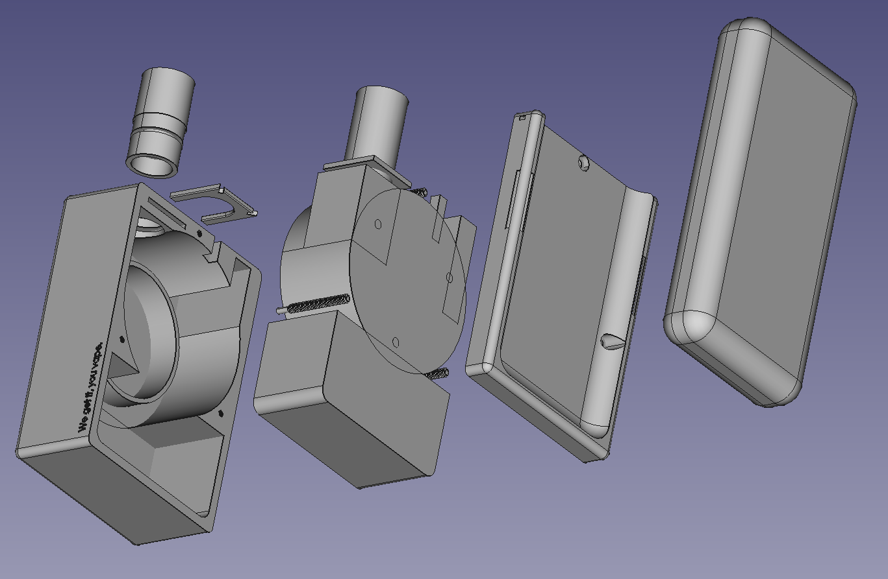
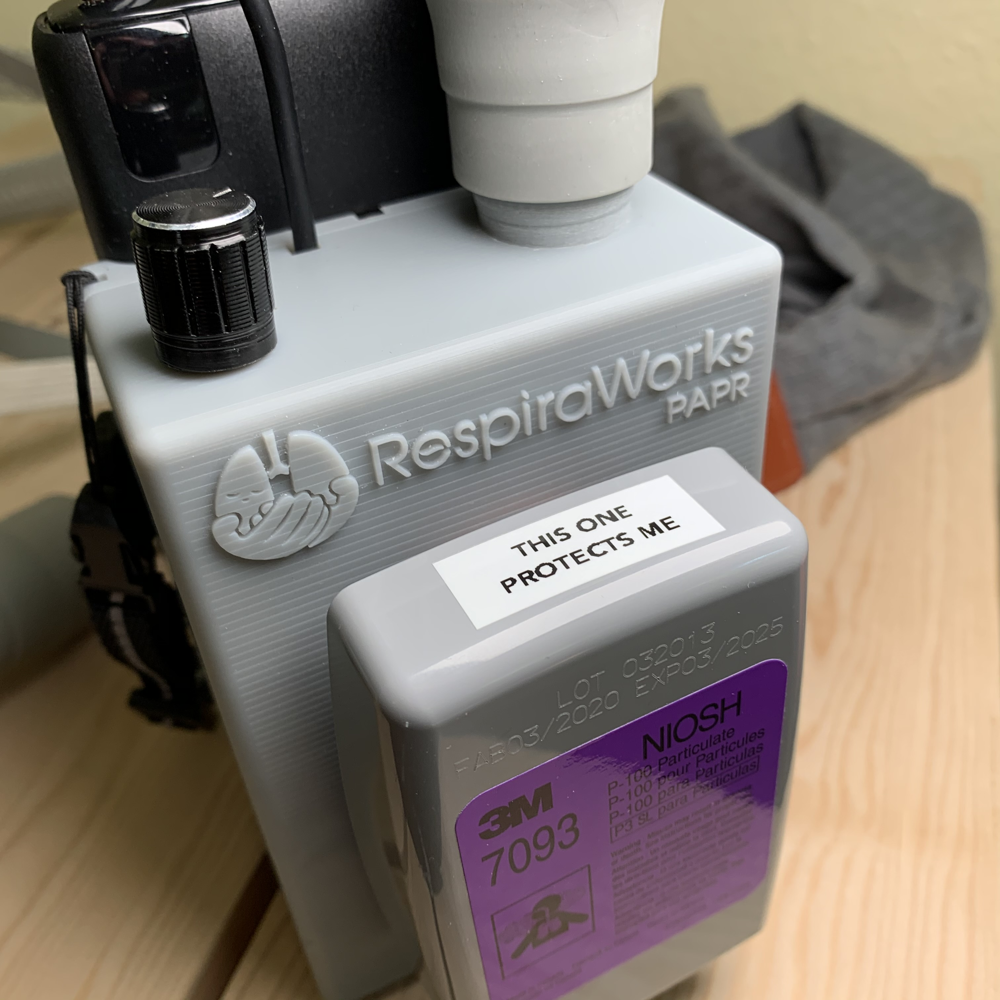
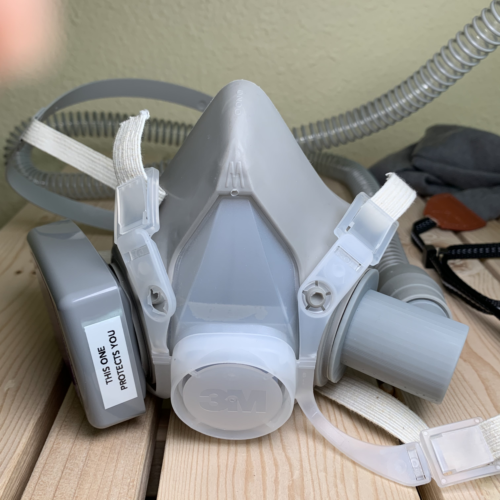
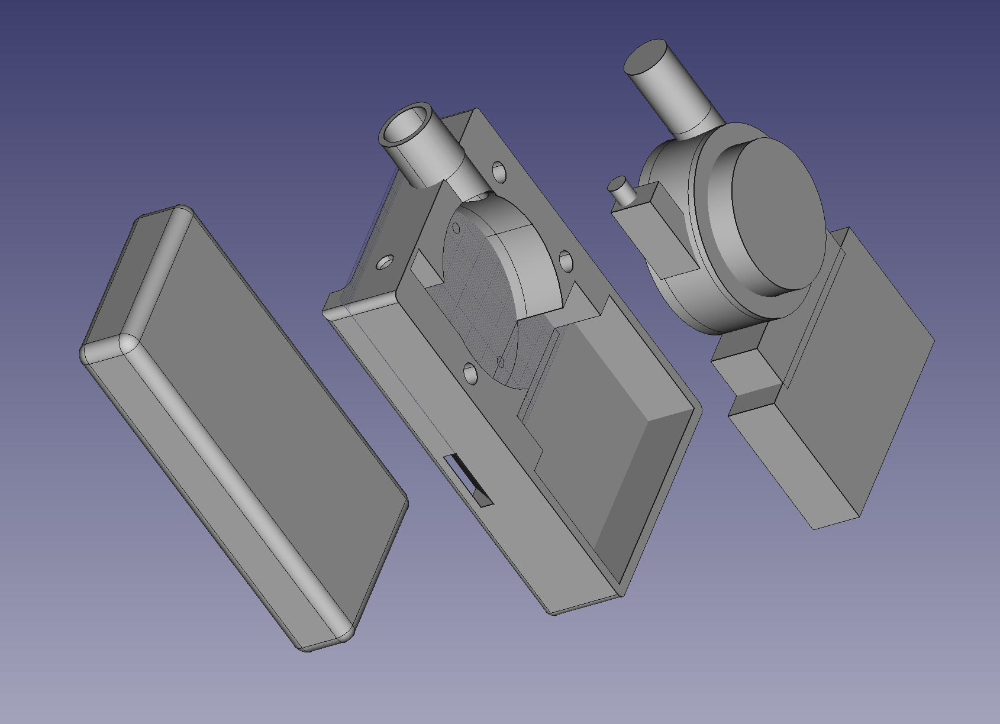
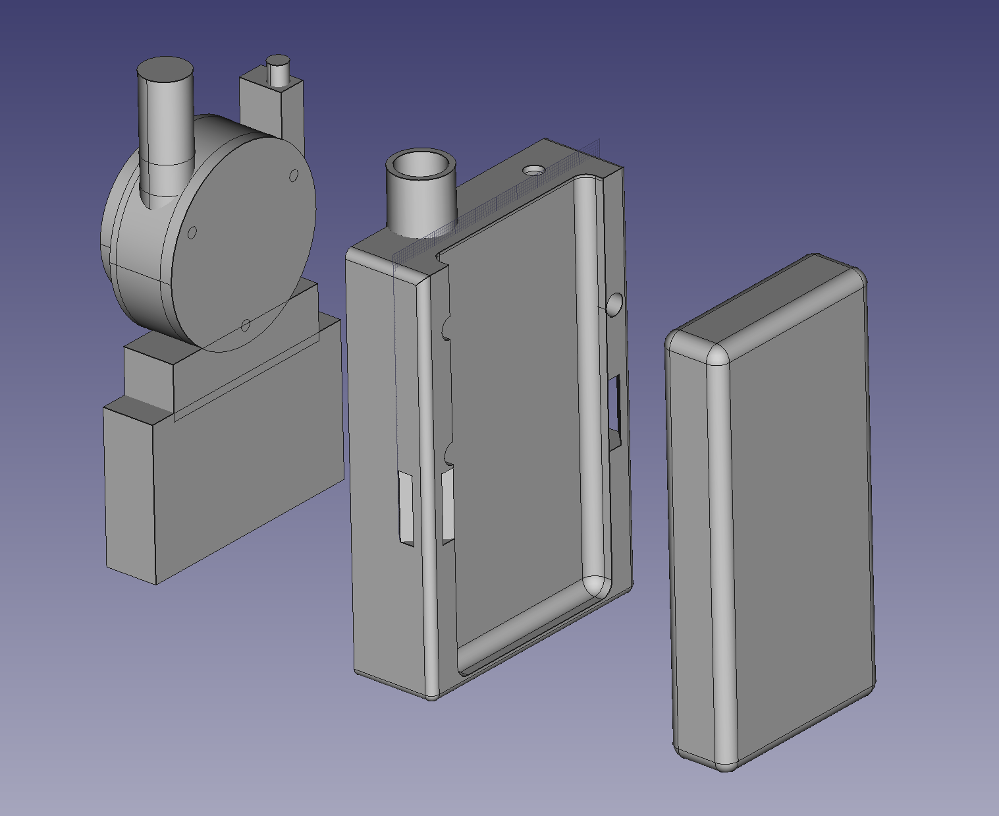
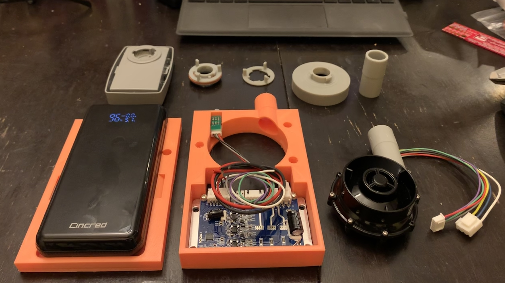

# RespiraWorks PAPR Project

This is a low-cost 3D-printable PAPR project by Edwin Chiu (github: inceptionev)

Most of the work is being done in the sandbox folder for now.  Once things are tested and working, files and instructions will move into the releases folder.  Most of the 3D files here were created in FreeCad v0.18.

I am making this for myself, and for my loved ones who are medical workers and essential workers.  They wear masks all day to keep us safe, and supplies of disposable PPE are not keeping up.

The combination of a respirator mask, powered air delivery, and commonly-available bayonet-mount filter packs provides a better face-seal, more comfortable breathing, and more re-usability than disposable masks. 

## Features:
- Uses commonly-available 6000-series or 7093 bayonet filter packs, which have many options in N95, P95, and P100 types.
- Powered by a USB-C PD battery pack (as long as it is 9V @ 2.0A capable)
- Packs can be swapped out for 8hrs+ of runtime per 20000mAH battery.
- If used with a modified respirator mask, it can be made to filter both inhaled and exhaled air.
- It can be used with a variety of full-head hoods, full-face masks, and respirator masks.

Also have a look at RespiraWorks' Ventilator project at https://respira.works and https://github.com/RespiraWorks/Ventilator

### Purchasing Source Key

* **A** = Aliexpress
* **C** = McMaster-Carr
* **W** = Wonsmart
* **K** = Digikey
* **3D** = 3D printed
* **Z** = Amazon
* **R** = RS computing
* **3M** = 3M

### (Work-in-Progress) Bill of Materials:
| Item | Quantity | Manufacturer  | Part #              | Price (USD)     |  Sources       | Notes |
| ---- |---------:| ------------- | ------------------- | ------------:|----------------| ----- |
| papr1   | 1 | Custom 3D print | TopLevelPart-Body | $6 (material) | [3D][3d1] | Main Body |
| papr2   | 1 | Custom 3D print | TopLevelPart-BatteryBack | $2 (material) | [3D][3d2]    | Battery Mount |
| papr3   | 1 | Custom 3D print | TopLevelPart-OutletAdapter | $1 (material) | [3D][3d3]    | 22mm Taper Hose Outlet |
| papr4   | 1 | Custom 3D print | TopLevelPart-OutletKey | $6 (material)  | [3D][3d4]    | key to hold the outlet in |
| papr5   | 1 | Custom 3D print | TopLevelPart-MaskAdapter | $2 (material) | [3D][3d5] | Adapter for bayonet-style mask |
| papr6   | 1 | Wonsmart | WS7040-12-X200 | $36 | [A][1ali] | Blower |
| papr7   | 1 | Generic | PotBrushlessController | $10.11 | [A][2ali] | Potentionmeter Brushless Controller |
| papr8   | 1 | Generic | 9V12V USB-C Trigger | $3.15 | [A][3ali] | USB-C 12V/9V PD Trigger |
| papr9   | 1 | Amazon | 6-inch USB-C Cable | $3.50 | [Z][1azmn] | 6-inch USB-C Cable |
| papr10   | 1 | Amazon | Carry Strap | $12.59 | [Z][2amzn] | Carry Strap |
| papr11   | 1 | Vishay | SA9.0CA-E3/54 | $0.42 | [K][1dk] | TVS diode |
| papr11   | 1 | ON Semi | MUR420G | $0.42 | [K][2dk] | Reverse Protection Diode |
| papr12   | 1 | Amazon | Velcro strap | $10 | [Z][3amzn] | Velcro Strap for Battery |
| papr13   | 1 | Conxwan | 26800mAh battery | $27 | [Z][4amzn] | 18W USB-C Battery |
| papr14   | 3 | Amazon | 6-32 x 3/8" Screws | $8.75 | [Z][5amzn] | Screws to secure back |
| papr15   | 1 | Amazon | 4ft CPAP hose | $10.57 | [Z][6amzn] | CPAP hose |
| papr16   | 1 | 3M | 7093 Filter Cartridge (pair) | $30 | [3M][3m1] | example filter packs |
| papr17   | 1 | 3M | 6200 Respirator Mask | $35 | [3M][3m2] | example respirator mask |

### Tools
| Item | Quantity | Manufacturer  | Part #              | Price (USD)     |  Sources       | Notes |
| ---- |---------:| ------------- | ------------------- | ------------:|----------------| ----- |
| papr-tool1   | 1 | Custom 3D print | InletGasketJigInsideV1 | $1 (material) | [3D][3d5] | Jig for cutting inlet gasket |
| papr-tool2   | 1 | Custom 3D print | InletGasketJigOutsideV1 | $1 (material) | [3D][3d6] | Jig for cutting inlet gasket |

[3d1]: https://github.com/RespiraWorks/PAPR/blob/master/sandbox/PAPR-MAIN-V7.FCStd
[3d2]: https://github.com/RespiraWorks/PAPR/blob/master/sandbox/PAPR-MAIN-V7.FCStd
[3d3]: https://github.com/RespiraWorks/PAPR/blob/master/sandbox/PAPR-MAIN-V7.FCStd
[3d4]: https://github.com/RespiraWorks/PAPR/blob/master/sandbox/PAPR-MAIN-V7.FCStd
[1ali]: https://www.aliexpress.com/item/32980201709.html
[2ali]: https://www.aliexpress.com/item/4001161829981.html
[3ali]: https://www.aliexpress.com/item/4000528106092.html
[1azmn]: https://www.amazon.com/gp/product/B01LONPUM4
[2amzn]: https://www.amazon.com/gp/product/B06XDNR14N
[1dk]: https://www.digikey.com/product-detail/en/vishay-semiconductor-diodes-division/SA9.0CA-E3-54/SA9.0CA-E3-54GICT-ND/3847567
[2dk]: https://www.digikey.com/product-detail/en/on-semiconductor/MUR420G/MUR420GOS-ND/1482828
[3amzn]: https://www.amazon.com/gp/product/B071DGMNMX
[4amzn]: https://www.amazon.com/gp/product/B08729Z2JX
[5amzn]: https://www.amazon.com/Stainless-Lengths-Available-Machine-Phillips/dp/B0793D86TB
[3d5]: https://github.com/RespiraWorks/PAPR/blob/master/sandbox/InletGastketJigs.FCStd
[3d6]: https://github.com/RespiraWorks/PAPR/blob/master/sandbox/InletGastketJigs.FCStd
[6amzn]: https://www.amazon.com/gp/product/B01DJGLEUG
[3m1]: https://www.3m.com/3M/en_US/company-us/all-3m-products/~/3M-Particulate-Filter-7093-P100-60-EA-Case/?N=5002385+3294776429&rt=rud
[3m2]: https://www.3m.com/3M/en_US/company-us/all-3m-products/~/3M-Half-Facepiece-Reusable-Respirator-6200-07025-AAD-Medium-24-EA-Case/?N=5002385+3294780295&preselect=3293786499&rt=rud

18 July 2020 Update:

10 July 2020 Udpate:

